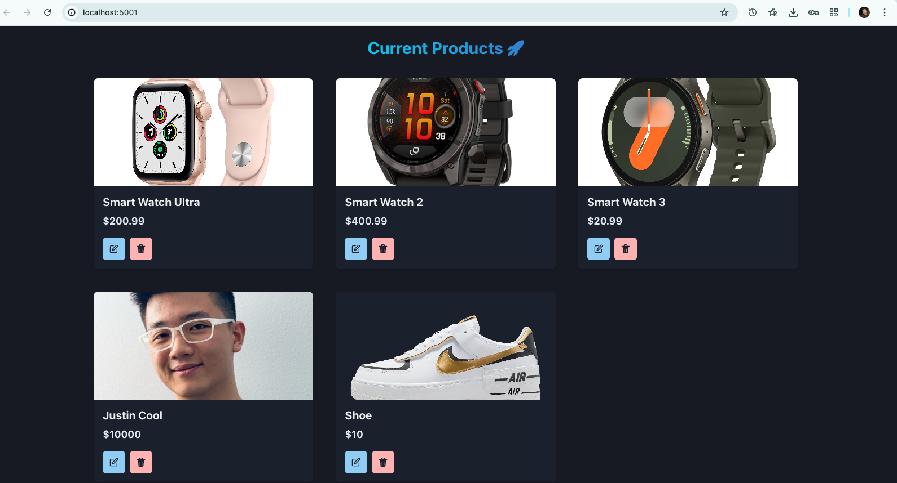
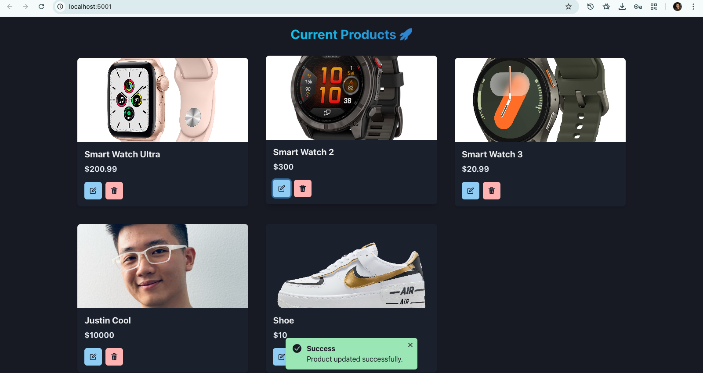

# Product Store with MERN

A full-stack web application for managing products with complete CRUD (Create, Read, Update, Delete) functionality. Built with the MERN stack to demonstrate modern web development practices.

## Tech Stack

### Frontend

- React - UI library
- Chakra UI - Component library
- Zustand - State management
- Vite - Build tool and dev server

### Backend

- Node.js - Runtime environment
- Express.js - Web framework
- MongoDB - Database
- Mongoose - ODM for MongoDB

## File Structure

```
Product-Store-with-MERN/
├── backend/
│   ├── config/
│   │   └── db.js                 # Database connection
│   ├── controllers/
│   │   └── product.controller.js # Product business logic
│   ├── models/
│   │   └── product.js            # Product schema
│   ├── routes/
│   │   └── product.route.js      # API routes
│   └── server.js                 # Express server entry point
├── frontend/
│   ├── public/                   # Static assets
│   ├── src/
│   │   ├── components/
│   │   │   ├── Navbar.jsx        # Navigation component
│   │   │   └── ProductCard.jsx   # Product display card
│   │   ├── pages/
│   │   │   ├── CreatePage.jsx    # Create product page
│   │   │   └── HomePage.jsx      # Product listing page
│   │   ├── store/
│   │   │   └── product.js        # Zustand store for state
│   │   ├── App.jsx               # Main app component
│   │   └── main.jsx              # React entry point
│   ├── index.html
│   ├── package.json
│   └── vite.config.js
├── .env                          # Environment variables
├── package.json                  # Root dependencies
└── README.md

```

## Features

- View all products in a responsive grid layout
- Create new products with name, price, and image
- Update existing product information
- Delete products
- Dark/Light mode toggle
- Real-time UI updates
- MongoDB integration for data persistence

## Getting Started

### Prerequisites

- Node.js (v14 or higher)
- MongoDB Atlas account or local MongoDB instance
- npm or yarn package manager

### Installation

1. Clone the repository

```bash
git clone https://github.com/imjustinliao/Product-Store-with-MERN.git
cd Product-Store-with-MERN
```

2. Install root dependencies

```bash
npm install
```

3. Install frontend dependencies

```bash
cd frontend
npm install
cd ..
```

4. Create a `.env` file in the root directory and add your MongoDB connection string

```bash
MONGO_URI=your_mongodb_connection_string
PORT=5001
```

### Running the Application

#### Development Mode

1. Start the backend server (from root directory)

```bash
npm run dev
```

2. In a separate terminal, start the frontend development server

```bash
cd frontend
npm run dev
```

The backend will run on `http://localhost:5001` and the frontend on `http://localhost:5173`.

#### Production Mode

1. Build the frontend

```bash
npm run build
```

2. Start the production server

```bash
npm start
```

The application will be served on `http://localhost:5001`.

## API Endpoints

- `GET /api/products` - Get all products
- `POST /api/products` - Create a new product
- `PUT /api/products/:id` - Update a product
- `DELETE /api/products/:id` - Delete a product

## Demo






## License

This project is open source and available under the MIT License.
